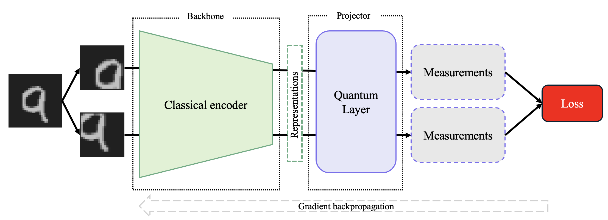

# Models proposed

## A Photonic Quantum Neural Network
The photonic quantum Neural Network is a hybrid quantum classical model made of trainable generic interferometers (in purple), an encoding layer (in gray), a learnable scale layer and a linear layer for class mapping.

  

To run: `python3 photonic_qNN/main.py`

### Arguments for photonic qNN:
- `--bs`: Batch size (default: 64)
- `--lr`: Learning rate (default: 0.05)
- `--modes`: Number of modes in the interferometer (default: 10)
- `--epochs`: Number of epochs to train the model (default: 10)
- `--size`: Size of the images that is used (default: 28)
- `--pca`: Define if PCA is applied on the data (default: False)
- `--pca_comp`: Number of PCA components used (default: 8)
- `--display`: Display layers, ConfMat and tSNE (default: False)

## A quantum Self Supervised Learning framework
The photonic quantum self supervised learning framework leverages a photonic interferometer as the projector from the representation space to the loss space.

  

To run: `python3 photonic_SSL/main.py`

### Arguments for photonic qSSL:

#### Data parameters:
- `-cl, --classes`: Number of classes (default: 10)
- `-s, --size`: Size x size of the image (default: 20)
- `-d, --datadir`: Data directory (default: './data')

#### Training parameters:
- `-e, --epochs`: Number of epochs for training (default: 10)
- `--ft-epochs`: Number of epochs for fine tuning (default: 10)
- `-bs, --batch_size`: Batch size (default: 128)

#### SSL model parameters:
- `-bn, --batch_norm`: Set if we use BatchNorm after compression of the encoder
- `-bck-d, --backbone-dim`: Dimension of the backbone output (default: 64)
- `--cnn`: Backbone is CNN if True, MLP otherwise
- `--enc-dim`: Dimensions of the encoder (default: [8, 8])

#### Contrastive Loss parameters:
- `-tau, --temperature`: Temperature of the InfoNCELoss (default: 0.07)

#### Quantum SSL parameters:
- `-w, --width`: Dimension of the features encoded in the QNN (default: 8)
- `-quant, --quantum`: Set if we use Quantum SSL
- `-m, --modes`: Number of modes (default: 10)
- `--no_bunching`: NoBunching mode for the quantumlayer
- `--trained`: If Boson Layer is trained

#### Display parameters:
- `--no-plots`: Disable plot display