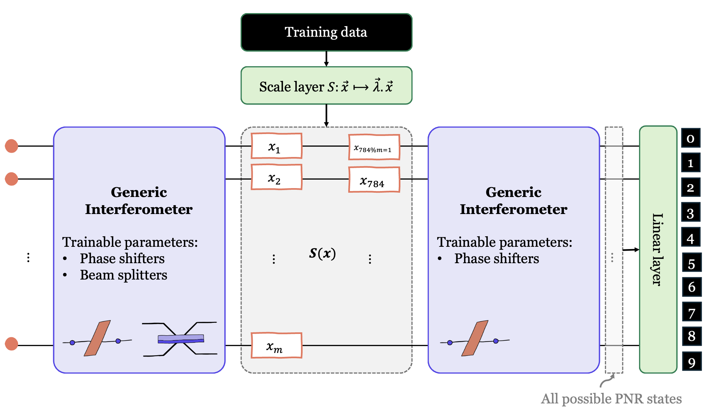

# Models proposed

## A Photonic Quantum Neural Network
The photonic quantum Neural Network is a hybrid quantum classical model made of trainable generic interferometers (in purple), an encoding layer (in gray), a learnable scale layer and a linear layer for class mapping.

  

